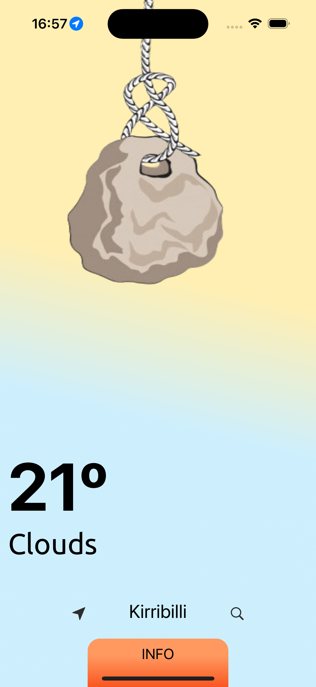
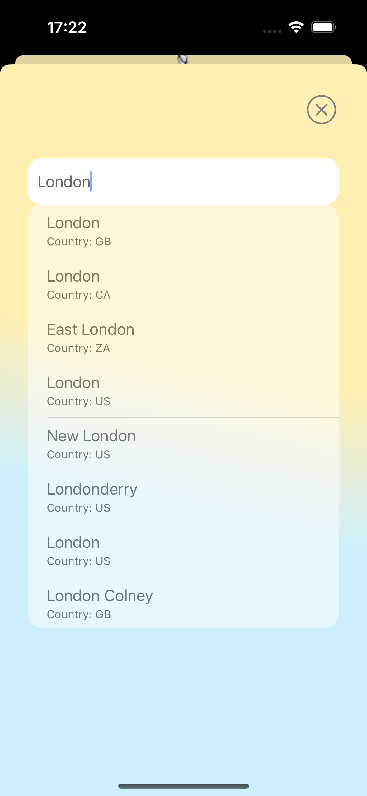
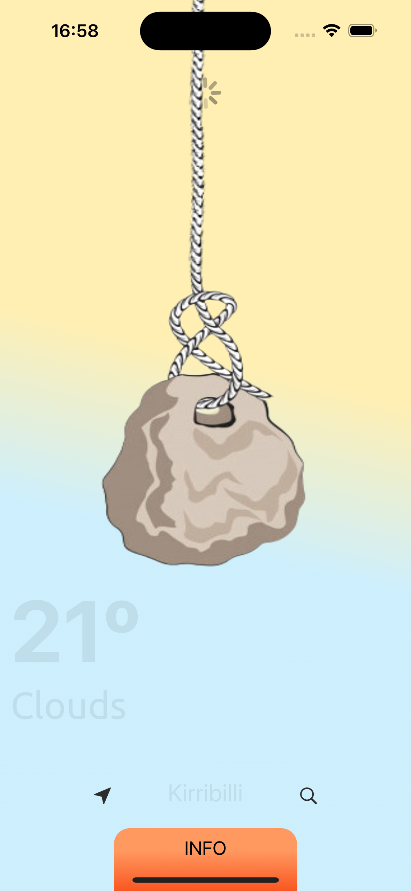
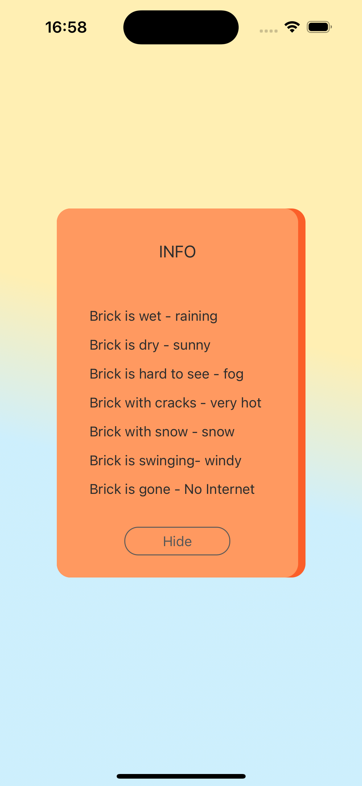

# Alex Weather 

Two page weather forecast application via API request. MVC with UI tests.

## Description

Weather forecast application that:
- allows to get weather information in your current location
- allows to get weather information in other location worldwide
- shows you interesting weather condition using simple stone (hot, cold, rainy or fog conditions)
- allows you update information if you pull down the stone
- shows animation if there is a wind more then 1 m/s
- shows animation if there is no internet
- update your current location
  
## Screenshots

|                  Initial view                   | Searching                                      |                    Updating                     | Details                                         |
| :---------------------------------------------: | ---------------------------------------------- | :---------------------------------------------: | ----------------------------------------------- |
|  |  |  |  |
|                                                 |                                                |                                                 |                                                 |

### Pods

* [Snapkit](https://github.com/SnapKit/SnapKit)
